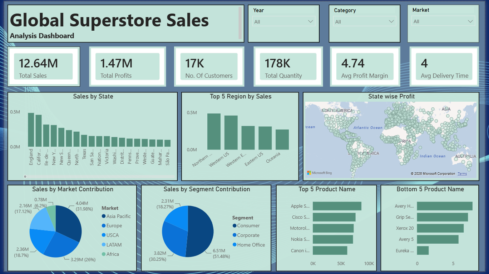

# 📊 Global Superstore Sales Analysis Dashboard

An interactive Business Intelligence dashboard built with **Microsoft Power BI** to analyze sales performance, profitability, customer behavior, and regional trends using the Global Superstore dataset.

---

## 📌 Project Overview

The **Global Superstore Sales Analysis Dashboard** provides comprehensive insights into sales and business performance through interactive visualizations and KPIs. The project demonstrates the complete Power BI workflow, including data cleaning, transformation, data modeling, DAX calculations, and dashboard development.

The dashboard enables users to monitor key business metrics, identify top and bottom-performing products, evaluate regional performance, and make data-driven decisions using interactive filters.

---

## 🎯 Objectives

- Analyze overall sales and profit performance.
- Monitor key business KPIs.
- Identify high-performing and low-performing products.
- Evaluate sales across different markets and customer segments.
- Visualize state-wise profitability.
- Create an interactive dashboard for business users.

---

## 🛠️ Tools & Technologies

- Microsoft Power BI
- Power Query
- DAX (Data Analysis Expressions)
- Data Modeling
- Data Cleaning
- Data Visualization

---

## 📈 Dashboard Features

### Interactive Filters
- 📅 Year
- 📦 Category
- 🌍 Market

### KPI Cards
- 💰 Total Sales
- 📈 Total Profit
- 👥 Total Customers
- 📦 Total Quantity
- 🚚 Average Delivery Time
- 📊 Average Profit Margin

### Visualizations
- 📍 Sales by State
- 🌎 Top 5 Regions by Sales
- 🗺️ State-wise Profit Map
- 🥧 Sales by Market
- 🥧 Sales by Customer Segment
- 📊 Top 5 Products by Sales
- 📊 Bottom 5 Products by Sales

---

## 📷 Dashboard Preview

<p align="center">
  
</p>
---

## 📊 Business Insights

- Monitor overall business performance through KPIs.
- Identify the most profitable states and markets.
- Compare customer segment contributions.
- Analyze sales trends across different years.
- Identify best-selling and least-selling products.
- Support data-driven business decisions.

---

## 📂 Repository Structure

```
Global-Superstore-Sales-Dashboard/
│
├── Dashboard.png
├── Global_Superstore.xlsx
├── Dashboard.png
├── README.md
```

---

## 🚀 Key Skills Demonstrated

- Data Cleaning & Transformation
- ETL using Power Query
- Data Modeling
- DAX Measures
- KPI Development
- Interactive Dashboard Design
- Business Intelligence
- Analytical Thinking
- Data Visualization

---

## 📌 Future Enhancements

- Forecasting Analysis
- Drill-through Pages
- Row-Level Security (RLS)
- Advanced DAX Measures
- Performance Optimization

---

## 🤝 Connect With Me

**Deepak Kashyap**

- 💼 LinkedIn: https://www.linkedin.com/in/deepakkashyaphere/

---

⭐ **If you found this project helpful, consider giving this repository a Star!**
